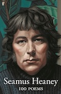
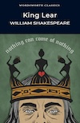
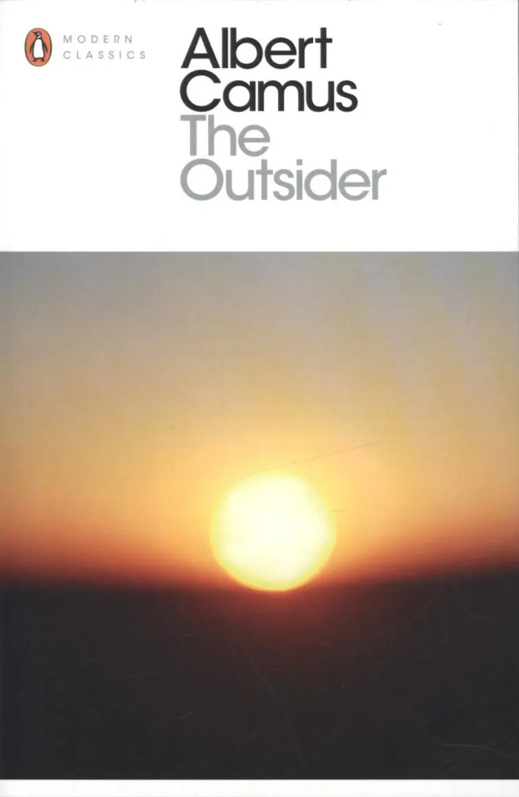
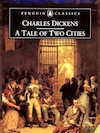

<!--
The profile README for my GitHub profile.
Feel free to adapt it to your needs, but a star would be appreciated!
-->

<!--
The titular banner.
Made with https://readme-typing-svg.demolab.com/demo

The font is "Fira Code".
The height is 60px and the width is 350px.
The second banner takes 3000ms to type and remains for 400ms.
The colour is #A2BBF7FF.
-->

  

  

<!--
The links, social media and contact section.

The images are from https://flaticon.com
The colours were adapted with https://onlinepngtools.com/change-png-color
-->

    
    
    

<!-- The views section. -->

    

<!-- The introduction section. -->

<h1>👋 About Me</h1>

    
After law school and passing the New York bar, I decided to make a lateral move into software engineering. Hired right out of a coding bootcamp, I've been in my current role for the past four years. I lead development on the backend, working primarily with Node.js and Firebase. I also have experience with React and Dart/Flutter. Outside of work, I enjoy art, history and literature. I currently live in London but work remotely and consequently get to travel a lot!

<!--
The stacks section.
Only the most relevant stacks are shown.

The images were created with https://shields.io
and: https://custom-icon-badges.demolab.com/badge/Firebase-356DF0.svg?logo=firebase

In future, if desired, the images can link to:
https://github.com/search?q=user%3APopeJuliusII+language%3Ajavascript
-->

<h1>🛠️ My Current Tech Stack</h1>

<h2>Cloud Platforms</h2>

    
    
    

<h2>Languages and Tools</h2>

    
    
    
    
    
    
    
    

<!-- The books section. -->

<h1>📚 Last Five Works Of Literature I've Consumed</h1>

    

        

            

                
            

            

                

                

            

            

                
1. <i>100 Poems</i> by Seamus Heaney

                
Heaney is a masterful storyteller and one of the few modern poets worth reading. His work is both accessible and profound, and I highly recommend it, especially for those who are new to poetry.

            

        

        

            

                
2. <i>Uncle Vanya</i> by Anton Chekhov

                
I initially read this in preparation for Andrew Scott's one-man adaptation, <i>Vanya</i>, and the play did not disappoint. Checkhov pairs levity with a melancholic meditation on the human condition. It is well worth a read.

            

            

                

                

                

            

            

                
            

        

        

            

                
            

            

                

                

                

            

            

                
3. <i>King Lear</i> by William Shakespeare

                
Unquestionably one of Shakespeare's greatest works, <i>King Lear</i> is a masterful tapestry of betrayal, redemption and tragic irony. The Bard's ability to interweave the various plots is mesmerising. It is also a play which generally does not translate well to the stage, so reading it is definitely a viable option.

            

        

        

            

                
4. <i>The Outsider</i> by Albert Camus

                
Camus' absurdist philosophy speaks to me on a personal level and <i>The Outsider</i> is a great introduction to it. Pairs well with a side of Bartleby.

            

            

                

                

                

            

            

                
            

        

        

            

                
            

            

                

                

            

            

                
5. <i>A Tale of Two Cities</i> by Charles Dickens

                
Dickens' is unmatched in his ability to paint a scene. An example of can be found in Book 1, Chapter 5, the scene with the spilling of the wine cask. If you want to get lost in artful prose, this is the book for you.
 
            

        

    

<!-- The footer section, for contact information. -->

To view more of my interests, check out my <a href="https://edgarb.io" target="_blank">website</a> or <a href="https://linkedin.com/in/edgar-loves-python/" target="_blank">LinkedIn</a>. To reach out, send me an <a href="mailto:edgarb@tuta.io" target="_blank">e-mail</a>, I don't bite!

